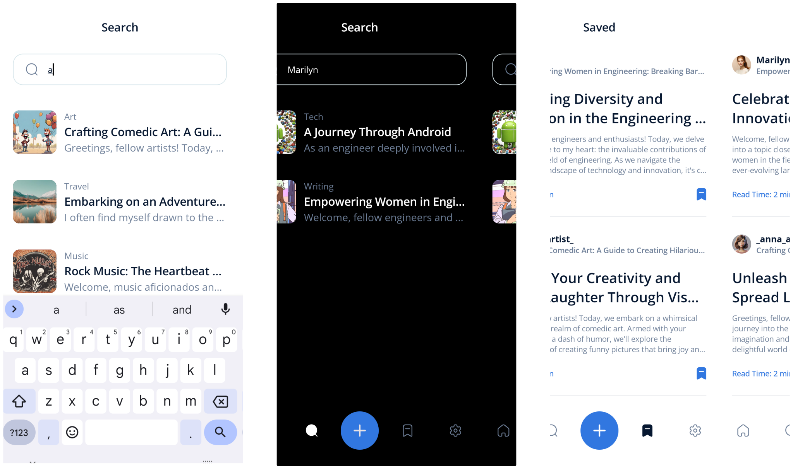

# View :iphone:
View is a Mobile Application allowing users to write and read articles or blogs based on their interests

## Navigation Graph

  

## Screens and Features
### Authentication

* Email and Password Signin / Signup
* _Google_ Signin / Signup
* Reset Password
* Form Validation
* Contributors / Users and Topics _Selection_ phase after first application access
    

  

  

### Home

* _For You_ section: posts are shown based on the current selected filter
* _Trending Now_ section, i.e., most saved posts
* _Following_ section: following users posts
* Posts are loaded as a _Stream_ for instant updates
* More Posts are loaded on end list reaching for better performances

  

### Search and Bookmarks

* Posts can be searched by simply typing the name, topic or author of the Post
* Bookmarked Posts are placed in a single spot

  

### Settings and User Profile

* User Profile Customizaion
* User statistics

  

### Post

* Post creation with required fields for button enabling
* Image Upload

  

### More
* Dark Mode
* Localization for :us:/:uk: and :it: languages
* Responsive Design for tablets
  
## Architecture

* The **S.O.L.I.D** principles are adhred to make the applications scalable, testable, maintanable, and resilient to change
* The **Dependency Injection** design pattern is implemented

  

## Testing

The application **is _not_** fully tested. Main tests like Unit, Integration, and End-To-End are used to analyze testing within the framework

## Tools
The application is written using the [Flutter](https://flutter.dev/) framework. The main packages used from the [pub.dev](https://pub.dev/) platform are the following:

### UI and Design:
* flutter_screenutil: helps with responsive UI design by adapting to different screen sizes

### State Management and Logic:
* bloc and flutter_bloc: facilitate the implementation of the BLoC pattern for State Management
* bloc_concurrency and stream_transform: assist in handling asynchronous operations and concurrency
* get_it and injectable: dependency injection frameworks for managing object dependencies
* flow_builder: allows navigation and state management based on flows

### Form Handling:
* formz: helps with form validation and management

### Firebase Integration:
* firebase_storage, cloud_firestore, firebase_auth: Firebase SDKs for storage, database, and authentication
* google_sign_in: allows integration with Google sign-in services

### Testing:
* test, bloc_test, and mocktail: assist in writing unit tests and mocking dependencies
* fake_cloud_firestore, firebase_storage_mocks, firebase_auth_mocks, google_sign_in_mocks: mocking libraries for testing Firebase services and Google sign-in

### Utility:
* intl: provides internationalization and localization utilities
* image_picker: allows users to pick images from the device's gallery or camera

## Firebase Config
* code/android/app : your google-services.json
* code/lib : your firebase_options.dart